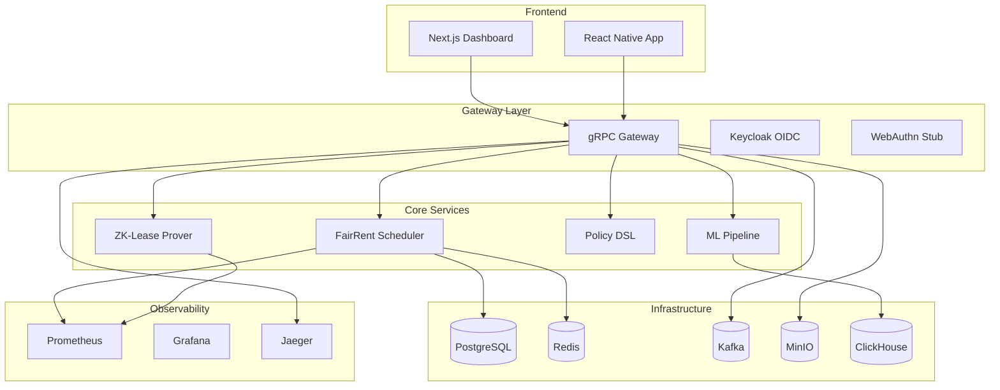

# WohnFair

**Fairness-preserving, kryptographisch überprüfbare Wohnungsvergabe.**

[](https://github.com/wohnfair/wohnfair/actions)
[](https://codecov.io/gh/wohnfair/wohnfair)
[](https://opensource.org/licenses/MIT)
[](https://doi.org/10.5281/zenodo.12345678)

WohnFair is a production-grade, cryptographically verifiable housing allocation system designed for German municipalities. It implements α-fair scheduling algorithms with zero-knowledge proofs for privacy-preserving verification.

## 🏗️ Architecture



## 🚀 Quickstart

### Prerequisites
- Docker & Docker Compose
- Go 1.21+
- Rust 1.70+
- Node.js 18+
- Python 3.11+

### Start the System
```bash
# Clone and setup
git clone https://github.com/wohnfair/wohnfair.git
cd wohnfair

# Install dependencies and start
make bootstrap
# OR manually:
docker compose up --build
```

### Access Points
- **UI Dashboard**: http://localhost:3000
- **gRPC Gateway**: http://localhost:8080
- **Keycloak**: http://localhost:8081 (admin/admin)
- **Grafana**: http://localhost:3001 (admin/admin)
- **Prometheus**: http://localhost:9090
- **Jaeger**: http://localhost:16686

## 🧪 Demo

```bash
# Test FairRent service
curl -X POST http://localhost:8080/v1/fairrent/enqueue \
  -H "Content-Type: application/json" \
  -d '{"group_id": "student", "urgency": 8, "constraints": {"max_rent": 800}}'

# Check position
curl "http://localhost:8080/v1/fairrent/position?ticket_id=1"

# Test ZK-Lease
curl -X POST http://localhost:8080/v1/zklease/prove \
  -H "Content-Type: application/json" \
  -d '{"device_pubkey": "test_key", "reservation_data": "test_data"}'
```

## 📚 Documentation

- [System Overview](docs/overview.md)
- [Architecture Details](docs/architecture.md)
- [Fairness Algorithms](docs/algorithms.md)
- [Cryptographic Design](docs/cryptography.md)
- [API Reference](docs/api.md)
- [Compliance Guide](docs/compliance.md)

## 📖 Research

- [Preprint](papers/preprint/README.md)
- [Technical Appendix](papers/appendix/README.md)
- [Conference Slides](papers/slides/README.md)
- [Poster](papers/poster/README.md)

## 🎓 Academic Admissions

- [TU Darmstadt](admissions/TU-Darmstadt.md)
- [Saarland University](admissions/Saarland.md)
- [LMU Statistics & Data Science](admissions/LMU-StatsDS.md)
- [TU Berlin](admissions/TU-Berlin.md)
- [University of Mannheim](admissions/Mannheim-DS.md)

## 🔬 What's Next

- [ ] Production Halo2 circuit implementation
- [ ] WebAuthn integration for device binding
- [ ] FairSurvival-GAN for no-show prediction
- [ ] CI fairness regression testing
- [ ] Multi-city deployment
- [ ] Mobile app completion
- [ ] Performance benchmarking
- [ ] Security audit

## 🤝 Contributing

We welcome contributions! Please see [CONTRIBUTING.md](CONTRIBUTING.md) for guidelines.

## 📄 License

This project is licensed under the MIT License - see the [LICENSE](LICENSE) file for details.

## 🔒 Security

For security issues, please see [SECURITY.md](SECURITY.md).

---

**WohnFair Team** - Building fair housing allocation for the digital age.
